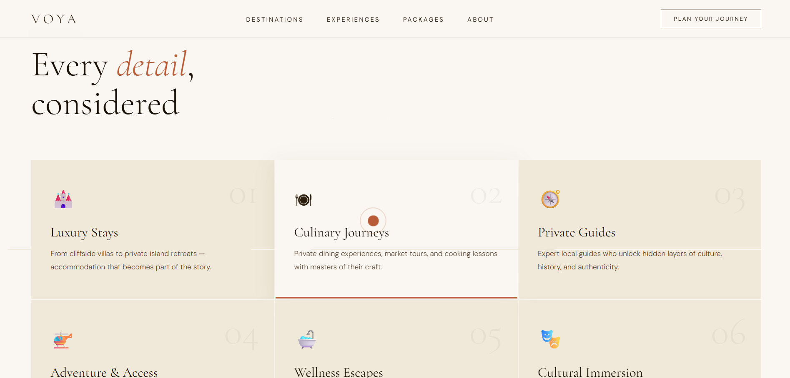

# 🌍✈️ Travel Agency Website  
### *Explore the World with Ease & Comfort*


---

## 📌 Project Overview  
The **Travel Agency Website** is a modern and responsive web application designed to help users explore travel destinations, view tour packages, and plan their trips easily.  

It provides an attractive user interface with smooth navigation, making travel planning simple and enjoyable.

---

## 🚀 Live Demo  
🔗 **Visit Website:**  
👉 https://ctt-vaishnavi.github.io/TravelAgencyWebsite/

---

## ✨ Features  
- 🌎 Explore popular travel destinations  
- 📦 View curated tour packages  
- 📱 Fully responsive design (mobile-friendly)  
- 🎨 Clean and modern UI/UX  
- 🔍 Easy navigation and structured layout  
- 📸 Attractive visuals and travel sections  

---

## 🛠️ Tech Stack  
- **Frontend:** HTML5, CSS3, JavaScript  
- **Styling:** Custom CSS  
- **Deployment:** GitHub Pages  

---

## 📸 Screenshots  

  
  
  

---

## ⚙️ Installation / How to Run  

```bash
# Clone the repository
git clone https://github.com/ctt-vaishnavi/TravelAgencyWebsite.git

# Navigate into the project folder
cd TravelAgencyWebsite

# Open index.html in browser

---

📂 Folder Structure
TravelAgencyWebsite/
│── index.html
│── css/
│   └── style.css
│── js/
│   └── script.js
│── images/
│── assets/

---

🔮 Future Enhancements
🤖 AI-based travel recommendations
🔐 User authentication (Login/Register)
💳 Online booking & payment integration
🌐 Backend integration (MERN stack)
📊 Personalized dashboards
👩‍💻 Author

---

Vaishnavi Shinde
🎓 Computer Engineering Student
💻 Passionate about Web Development

---

⭐ Show Your Support

If you like this project, please ⭐ the repository and share it!

